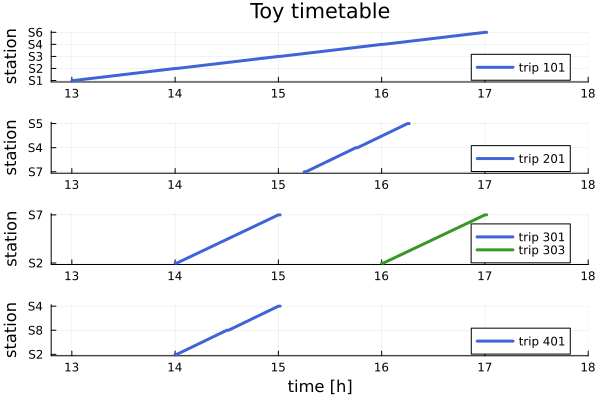

# Toy example

Toy example from tests.
We wish to travel from station S2 to S4 at 13:15 on 2024-10-21. The first figure shows the network and the second the timetable.


*Schematic of the rail network as toy example. The colored ellipses denote stations (S1, ..., S8) and the gray circles with numbers denote platforms in the stations. 
A line connecting to platforms denotes that a train is scheduled to drive from one platform to the other. 
The name of the route (R1, ..., R4) is written next to the line connecting two platforms. 
The euro sign € denotes that for a trip between S8 and S4 an extra fare is needed. 
The thin lines between platforms denote footpaths.*



*Timetable of toy example. The horizontal axes denotes time, the vertical one the stations. The different colors are the different trips.*

```@example
# Load function to create the test timetable
using Raptor
using Dates

# Create timetable for toy example
include("../../test/create_test_timetable.jl")
timetable = create_test_timetable();
today = Date(2021, 10, 21)

# Create the query
origin = "S2"
departure_time = today + Time(13, 15)
query = McRaptorQuery(origin, departure_time, timetable)

# Calculate all journey options departing from S2 at 13:15
bag_round_stop, last_round = run_mc_raptor(timetable, query);
journeys = reconstruct_journeys_to_all_destinations(
    query.origin, timetable, bag_round_stop, last_round
);

# Print the journey options to S4
destination = timetable.stations["S4"];
print(journeys[destination])
```

We see there are three non dominated options.
- Option 1: A direct very fast one that costs extra.
- Option 2: A direct one and free of extra charge but slow.
- Option 3: A moderately fast one, free of extra charge, but with a transfer.
